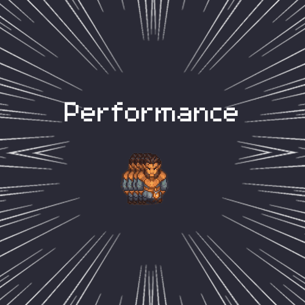

## ⚠️ AI DISCLAIMER: This project is a vibecoded project.
I have not doublechecked every line of code in this repository.

# Performance Fixes



**Links:** [Steam Workshop](https://steamcommunity.com/sharedfiles/filedetails/?id=3809616755) · [Nexus Mods](https://www.nexusmods.com/graveyardkeeper2/mods/211) · [Source code](https://github.com/kevinsnijder/GK2-Performance-Fixes)

A BepInEx 5 mod for **Graveyard Keeper 2** that removes stutter and freezes while walking, using doors, meeting NPCs and workers, and opening menus. It also draws outdoor areas faster. It doesn't change how the game plays, the only visual change is a softer back light (optional), and it never touches your save files.

## What it fixes

| Problem | Fix | Setting |
|---|---|---|
| Walking judders: the player moves at the 50 Hz physics rate while the screen draws faster | Smooths the player's movement between physics steps | `SmoothPlayerMotion` |
| Short freezes while walking, when buildings and props come into view and load from disk | Starts loading them before they reach the edge of the screen | `PrewarmPadding` |
| Hitches while walking when several buildings, stations, trees or NPCs come near the screen in the same frame | Spreads that work over the next frames with a small time budget, still well before they're on screen | `PrewarmBudgetMs` |
| NPCs, workers and animals load at the last moment and pop in | Loads them in the same band around the screen as buildings | `PrewarmMovingObjects` |
| Hitches the first time you walk into an unvisited part of an area | Loads everything an area needs when it loads | `PreloadWorld` |
| Hitches during the first seconds after a loading screen, while that loading is still going on | Keeps the loading screen up until the area and the menus are loaded (a few seconds, with a time limit) | `HoldLoadingScreen` |
| A freeze the first time a worker starts a craft near you, and other first-time freezes: the game searches every object for one of its managers | Sets those managers up behind the loading screen | `PrepareManagers` |
| Decor pops in all at once, and is thrown away and recreated at the screen edge | Spawns off-screen decor a little at a time and keeps it until it's well out of view | `OffscreenPreload` |
| Freezes when a decor prefab is needed for the first time | Loads it in the background first | `AsyncPrefabWarmup` |
| 0.5–1 s freeze on every door or staircase inside the same area | Skips the memory cleanup that causes it; leaving an area, sleeping and loading still clean up | `SkipCleanupOnLocalTeleport` |
| A ~20 ms freeze every minute or two from the garbage collector | Runs it while the screen is black (door fades, end of a loading screen), so it rarely happens during play | `CollectGarbageWhenHidden` |
| After any slow frame the game runs all the world logic it missed (crafting, conveyors, NPCs) at once, so the next frame is slow too | Runs at most one extra step per frame and the rest in the following frames; no game time is lost | `SmoothWorldUpdates` |
| ~0.5 s delay when pressing Esc: the game takes a screenshot for its bug reporter first | Skips the screenshot and turns off the bug reporter (Shift+F5 and its pause-menu button) | `DisableBugReporter` |
| Every menu lags the first time it opens | Loads all menus in the background | `PrefetchMenus` |
| The inventory lags the first time it opens, and big chests create hundreds of item cells at once | Creates the inventory window and the item cells behind the loading screen | `PrecreateWindows` |
| The camera jumps when you open a menu while walking | Keeps the camera moving at a normal pace for the first frames | `SmoothCameraOnMenuOpen` |
| The game's back light, a second sun pointing upward, draws every object it touches once more (about a fifth of the frame time outdoors) for a faint bluish rim on tree leaves and some walls | `Soft` (default): the same light is added to the normal lighting pass instead. It looks almost the same, only a little softer. `Off` turns it off with the game's own switch | `BackLight` |
| With `BackLight = Normal`: the back light can never reach the ground, yet the ground is drawn once more for it every frame (about 200 extra draw calls outdoors) | The ground skips that pass; every other light and camera sees it exactly as before | `SkipBackLightOnTerrain` |
| CPU wasted on the game's many log messages | Stops recording where each info or warning message came from; errors still do | `DisableInfoStackTraces` |
| With [No More Running Back](https://steamcommunity.com/sharedfiles/filedetails/?id=3806668942): a second hitch right after a chest opens, because its queue next to chests is built twice | Skips the repeat when the queue was just built | `SkipNotepadRebuild` |
| With [No More Running Back](https://steamcommunity.com/sharedfiles/filedetails/?id=3806668942): ~0.25 s freeze when opening a chest in a big storage area like the yard (21 storages) | Redraws the chest window in one go instead of one storage at a time (270 ms → 35 ms) | `BatchNotepadChestRedraw` |

The last two only do something when No More Running Back is installed. Without it, the mod works the same and those two settings have no effect.

All time budgets are in milliseconds per frame, so they work the same on fast and slow PCs: a slower PC takes a few more frames for the same work instead of freezing longer.

### Measured

A scripted run on the same save: load, leave the house, walk through the village and the port for 2.5 minutes, open chests, go back in, open the pause menu. RTX 3070, 16 threads, 3440×1440, uncapped frame rate.

| | Game only | With the mod |
|---|---|---|
| Door out / door in | 1065 ms / 912 ms freeze | hidden in the fade (a few frames while the screen is black) |
| Pause menu (Esc) | 269 ms | 12 ms |
| First 15 s after loading | no hitches | no hitches (1.0.3 had hitches up to 115 ms here) |
| Walking: frames over twice the usual frame time | 36 | 6 |
| Walking: frames over 25 ms | 5 | 2 |
| Walking: slowest 1% of frames | 16.1 ms | 14.4 ms |
| Yard chest (21 storages), slowest frame | 284 ms | 177 ms |
| A worker starting a craft near you | ~45 ms | no hitch |
| Loading screen | 10 s | 15 s |
| Yard by day, average frame rate | 92 fps (10.9 ms) | 110 fps (9.1 ms) |
| Yard at night, average frame rate | 74 fps (13.5 ms) | 79 fps (12.7 ms) |
| Walking, average frame rate | 100 fps (10.0 ms) | 106 fps (9.4 ms) |

### Not fixed

- **Some sounds:** the game streams every sound from disk. Starting certain sounds costs the game ~10 ms, and a mod can't change how sounds are stored.
- **The first chest of a session with No More Running Back** takes ~0.3 s: the game draws the window for the first time and that mod sets itself up. Later chests are fast. With this mod it's about 50 ms slower than without, because that mod's setup searches all loaded objects and this mod keeps more of them ready.
- **Pathfinding updates** from a few scripted events can take ~40 ms. They're rare.
- **Busy areas like the yard** are still limited by rendering: the game draws every object once for each light that touches it. The back light is the only light that can be made cheaper without changing the picture much.
- **Crafting finishing at busy stations** runs the game's own crafting logic (and Better Auto Crafting's, if installed), which can take 10–30 ms.

## Install

Requires [BepInEx 5](https://github.com/BepInEx/BepInEx/releases/latest).

**Steam Workshop:** subscribe. With the GK2 Workshop auto-loader installed, it loads on the next game start.

**Manual:** download `GK2Performance-<version>.zip` from the [Releases](../../releases) page and copy its `BepInEx` folder into the game folder (Steam → right-click Graveyard Keeper 2 → Manage → Browse local files) and merge the folders:

```
Graveyard Keeper 2
└─ BepInEx
   └─ plugins
      └─ GK2Performance
         └─ GK2Performance.dll
```

`BepInEx/LogOutput.log` should then contain `GK2 Performance 1.1.1 loaded.`

**Uninstall:** delete `BepInEx/plugins/GK2Performance`, and optionally `BepInEx/config/gk2.performance.cfg`.

## Settings

`BepInEx/config/gk2.performance.cfg` is created on first start. Every fix can be turned off on its own; changes apply after restarting the game.

| Section | Setting | Default | What it does |
|---|---|---|---|
| General | `EnableOptimizations` | `true` | Master switch. `false` turns every fix off. |
| Motion | `SmoothPlayerMotion` | `true` | Smooth walking. |
| Motion | `SmoothCameraOnMenuOpen` | `true` | No camera jump when a menu opens while walking. |
| Preload | `PreloadWorld` | `true` | Load everything an area needs when it loads. Uses more memory. |
| Preload | `PreloadBudgetMs` | `2` | Milliseconds per frame the preloader may use during play (more behind the loading screen). |
| Preload | `PreloadInstancesPerPrefab` | `4` | Ready-made copies to keep per object type. `0` only loads them. |
| Preload | `HoldLoadingScreen` | `true` | Keep the loading screen up until the area and the menus are loaded. |
| Preload | `MaxHoldSeconds` | `20` | Longest extra time for that. Whatever is left then loads during play. |
| Preload | `PrepareManagers` | `true` | Set up the game managers that are otherwise searched for the first time they're used. |
| Streaming | `PrewarmPadding` | `6` | How far outside the screen (world units) objects start loading. The game uses `1`. |
| Streaming | `PrewarmBudgetMs` | `2` | Milliseconds per frame for loading buildings, stations, trees and NPCs near the screen. `0` = all at once, like the game. |
| Streaming | `PrewarmMovingObjects` | `true` | Use the same band for NPCs, workers and animals. |
| Streaming | `OffscreenPreload` | `true` | Spawn off-screen decor early and keep it while it's close. |
| Streaming | `OffscreenBudgetMs` | `1.0` | Milliseconds per frame for spawning off-screen decor. |
| Streaming | `OffscreenMaxPerFrame` | `24` | Max off-screen objects spawned per frame. |
| Streaming | `PreloadIncludesSceneObjects` | `false` | Also spawn scene objects early. These can have scripts or sounds, so it's off. |
| Streaming | `AsyncPrefabWarmup` | `true` | Load decor in the background before it's needed. |
| Streaming | `SkipCleanupOnLocalTeleport` | `true` | No freeze on doors and stairs within the same area. |
| World | `SmoothWorldUpdates` | `true` | After a slow frame, catch up on world logic over the next frames instead of all at once. |
| World | `CollectGarbageWhenHidden` | `true` | Run the garbage collector while the screen is black. |
| Menus | `DisableBugReporter` | `true` | No screenshot delay on Esc; turns off the bug reporter. |
| Menus | `PrefetchMenus` | `true` | Load all menus in the background. |
| Menus | `PrecreateWindows` | `true` | Create the inventory window and the item cells behind the loading screen. |
| Menus | `SkipNotepadRebuild` | `true` | No More Running Back: build the chest queue once instead of twice. |
| Menus | `BatchNotepadChestRedraw` | `true` | No More Running Back: redraw the chest window in one go. |
| Logging | `DisableInfoStackTraces` | `true` | Cheaper log messages. |
| Lighting | `BackLight` | `Soft` | `Normal`: as in the game. `Soft`: blended into the normal lighting, much faster outdoors, looks almost the same. `Off`: no back light, fastest. |
| Lighting | `SkipBackLightOnTerrain` | `true` | With `BackLight = Normal`: the ground skips the back light's extra pass. No visual change. |

## Safety

- Everything happens in memory. The mod never reads or writes save data, so you can add or remove it at any time, even mid-save.
- `BackLight` is the only setting that changes the picture: `Soft` (default) makes the faint rim light on leaves and walls a little softer. Set it to `Normal` and nothing looks different. Everything else only loads or keeps objects early while they're off screen or kept early while they're off screen. One small exception: particles from decor just off screen may drift into view, where the game would cut them off at the edge.
- Game updates: each fix is applied on its own. If an update changes something one fix relies on, only that fix switches off and the rest keep working; the game then behaves as usual for that part. The reason is logged in `BepInEx/LogOutput.log`. A fix that hits an unexpected error while playing also switches itself off instead of interrupting the game.
- The loading screen is never kept up longer than `MaxHoldSeconds`, and any error lets the game hide it as usual.

## Compatibility

Tested with [No More Running Back](https://steamcommunity.com/sharedfiles/filedetails/?id=3806668942) (installs `GK2Notepad.dll`), [Sort to nearby chests](https://steamcommunity.com/sharedfiles/filedetails/?id=3809824680), Better Auto Crafting and GK2 Move Stations.

No More Running Back switches itself off when another mod patches its code. This mod never patches it; it only reads and sets a few of its values and patches the game's own code instead. The mod doesn't patch any method that the other tested mods patch.

## How the No More Running Back fixes work

- **Chest queue built twice:** when a chest opens, the queue next to it is built, and built again two frames later. If the first build just happened, the second is cancelled. The first open of a chest window always keeps both.
- **Chest window freeze:** after a chest window opens or closes, the mod's chest lock feature redraws every storage in the window one by one. After each one the game lays out the whole window again, which is 22 full layout passes in the yard. This mod takes over that redraw: the same storages are redrawn in the same order, and the layout runs once at the end. The window and the queue look exactly the same.

## Building

Needs the .NET SDK. The project references the game's own files from the install folder; nothing is copied into it.

```
dotnet build -c Release
# game installed somewhere else:
dotnet build -c Release -p:GameDir="E:\Steam\steamapps\common\Graveyard Keeper 2"
```

The DLL ends up in `bin/Release/GK2Performance.dll`. `nuget.config` pins nuget.org as the only package source.

**Making a release:** copy the DLL to `dist/BepInEx/plugins/GK2Performance/` (and `workshop/content/BepInEx/plugins/GK2Performance/` for the Workshop), zip the `dist/BepInEx` folder as `GK2Performance-<version>.zip` and attach it to a GitHub Release. Both folders are git-ignored.

## Changelog

- **1.1.1:**
  - Higher frame rate outdoors: the back light no longer draws every object a second time. About 92 → 110 fps in the yard by day.
  - The off-screen loading does less work every frame, most of all while standing still (about 0.2 ms per frame less in the yard).
- **1.1.0:**
  - No more hitches in the first seconds after loading: the loading screen stays up (about 5 s longer) until the area and menus are loaded.
  - Smoother walking: buildings, stations, trees and NPCs near the screen now load a little at a time instead of all in one frame, and NPCs load before they walk into view.
  - No freeze the first time a worker starts a craft near you.
  - Garbage collection now mostly happens during door fades instead of while walking.
  - After a slow frame, the game no longer makes the next frame slow as well.
  - The inventory window and the item cells for big chests are created behind the loading screen.
  - A game update now only turns off the fix it affects, instead of the whole mod.
- **1.0.3:** with No More Running Back, no ~0.25 s freeze when opening a chest in a big storage area like the yard.
- **1.0.2:** with No More Running Back, no second hitch right after a chest opens.
- **1.0.1:** removed the chest-window speed-ups (they could leave No More Running Back's queue empty); the pause menu's "Report a bug" button is hidden; no camera jump when opening a chest while walking.
- **1.0.0:** first release.
